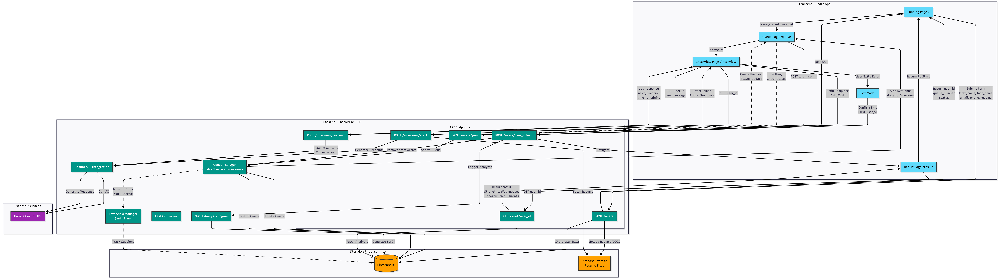

# AI Interview Platform

This repository contains the **backend** and **frontend** pieces for the AI Interview Platform. It is designed to take candidate resumes, queue them into a controlled interview session, conduct a Gemini-driven conversational interview, collect SWOT insights, and expose health/status endpoints for monitoring.

## Repository Structure

- `backend/`
  - FastAPI services that handle credentials, resume uploads, Cloud Tasks queueing, session management, and interview bot orchestration.
  - `Dockerfile`, `.env.sh`, and Jenkins scripts that package and deploy the backend image.
  - Detailed architecture notes in [`backend/README.md`](backend/README.md).
- `frontend/`
  - Separate UX/UI layer (React/Vite or similar) that consumes the backend APIs.
  - Stores its own `.env`, startup scripts, and package definition.

## Highlights

1. **Resumes & Credentials**
   - Resumes are uploaded in the `/users` flow, sanitized for CRLFs, stored in GCS, and parsed (PDF/DOCX) to extract resume text for later use.
   - GCP credentials (`creds.json`) power Firestore, Cloud Storage, and Cloud Tasks interactions.

2. **Queue & Session Control**
   - Firestore collections: `users`, `in_session`, `queue`, `global_stats`.
   - Cloud Tasks enqueue new candidates; a transactional join ensures at most three `in_session` users.
   - Background cleanup runs every minute, auto-expires sessions, promotes the next queue entry, and saves SWOT details before the user leaves.

3. **Interview Bot**
   - `/interview/start` and `/interview/respond` endpoints drive Gemini prompts built around resume text and history.
   - Responses include bot output, next question, remaining time, and queue awareness (idle/queue/session-over states).
   - Bot is explicitly instructed to focus on Full Stack Cloud Engineer topics (Next.js, React, FastAPI, Flask, Django, GCP) and ask only subjective questions.
   - When the session ends (or time expires), a polite closure runs and triggers a structured SWOT generation stored on the user document.

4. **Supporting Services**
   - `/status/{user_id}` reports queue position/time remaining.
   - `/swot/{user_id}` returns the generated SWOT once available.
   - `/health` exposes Firestore + Storage connectivity.

   

## Getting Started

1. Populate `/backend/.env.sh` with the GCP credentials.
2. Configure Jenkins to copy secrets (`gcp_json`, `ai_interview_env`) and build/push the backend image.
3. On the frontend, point API calls to the backend base URL, and use `/users`, `/interview`, `/status`, and `/swot` as needed.
4. Ensure Cloud Tasks queue (`interview-queue`) exists with concurrency 3, rate limit 3/sec, and retry/dead-letter policies set.

## How to Deploy

1. Build the backend Docker image (`docker build -t asia-south2-docker.pkg.dev/.../aibackend:latest ./backend`).
2. Push to Artifact Registry, then deploy to Cloud Run with the provided service account and env vars.
3. Run the frontend (`npm install`, `npm run dev`) or build for production and host it where your UI lives.

## References

- See `backend/README.md` for full backend architecture notes.
- Cloud Tasks configuration: `TASKS_PROJECT`, `TASKS_LOCATION`, `TASKS_QUEUE`, `TASKS_JOIN_URL`.
